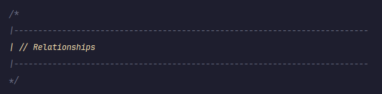

# General docs of the coding environemtn

I have decided to use this repo to document the changes that I broguht to my tools to make them work for me. 


## PhpStorm

### Theme
Catppuccin Theme and Catppuccin Icons

[Link](https://catppuccin.com/)


### Section Comment & Highlighting
I have added this [Live Template]() to under the PHP section in PhpStorm so that I can quickly introduce a section comment in my PHP files.

You can find the Live Templates settings section here:
```
Settings -> Editor -> General -> Live Templates
```

Useful for when I want to organize my class methods because a lot of them does something similer. Eg: Relationships, Accessors and Mutators

```
/*
|--------------------------------------------------------------------------
| $END$
|--------------------------------------------------------------------------
*/
```

Then I have also added the followin to the TODO Highlighting thing. You can find it here:
```
Settings -> Editor -> TODO
```

The following two regex patters should be added to the Patters section of this setting. 

```
^\s*|-+|.*$
```

```
^\s*|\s*.+?\s*|.*$
```

Once added, it should look something like this

